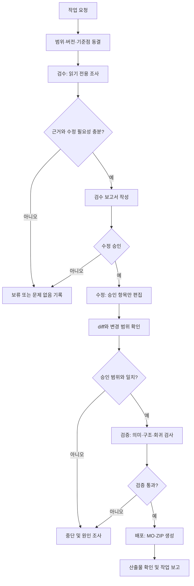

# Translation Review and Editing Role Separation

## Purpose

Prevent broad, repetitive, or self-approving translation changes by separating
problem discovery, editing, verification, and release work into explicit
stages.

The same person or AI may perform more than one role, but must not combine the
roles in one undifferentiated pass. Each stage has its own permitted files,
output, and stop conditions.

The glossary is curated evidence, not immutable truth. A real PO context may
expose a glossary error, over-generalization, or missing context. Such a
conflict is a review finding and must not trigger an automatic repository-wide
rewrite.

## Roles

### Reviewer

The reviewer performs a read-only inspection of PO files, the glossary, and
reference locales.

The reviewer may:

- identify a likely mistranslation, inconsistency, or structural risk;
- identify a conflict between a glossary value and an actual PO context;
- record the source key, current Korean text, proposed correction, evidence,
  confidence, and affected files;
- classify an item as accepted, uncertain, or not a problem.

The reviewer must not modify PO files, the glossary, generated MO files, or
release assets. Review output belongs under `work/<version>/audit/`.

### Editor

The editor applies only accepted review items.

The editor must:

- use the review report as the change scope;
- preserve entries that are not listed in the report;
- treat glossary changes as scoped edits that require an impact review;
- avoid global normalization or glossary reapplication unless the report
  explicitly names every affected entry;
- run mutating tools one at a time and inspect the diff immediately;
- stop if the changed files, entries, or lines exceed the review scope.

### Verifier

The verifier checks the editor's diff independently of the editing rationale.

The verifier must:

- compare the diff with the accepted review report;
- check for accidental changes to already-correct translations;
- check whether glossary values fit the actual PO contexts where they occur;
- check meaning, terminology, speaker style, and reference consistency;
- run unit tests, completion and structure audits, and `msgfmt --check`;
- reject the change if any unapproved entry changed or any required check
  fails.

Passing structural tests does not by itself establish that a translation is
semantically correct.

### Publisher

The publisher handles only an already-verified change.

The publisher may build MO files, create the release asset, and update a tag
or release record when explicitly requested. The publisher must not revise
translations, normalize the glossary, or rerun broad editing tools.

## Workflow

1. Freeze the baseline with `git status`, the current commit, and the target
   version.
2. Run a read-only review and write a scoped report under
   `work/<version>/audit/`.
3. Mark review items as accepted before editing.
4. Apply the smallest possible edit to accepted items only.
5. Inspect the diff and verify that it contains no unapproved changes.
6. Run independent semantic and structural verification.
7. Build MO files and release assets only after verification passes.
8. Report changed files, changed entry counts, checks run, and unresolved
   review items.

### Stage Transition Rules

- The baseline stage records the target version, current commit, clean or dirty
  state, and the requested scope.
- The review stage may write only the audit report. It cannot change PO,
  glossary, MO, or release files.
- The approval stage names the exact entries that the editor may change.
- The editing stage stops when the diff exceeds the approved file, entry, or
  line scope.
- The verification stage is independent of the editor's explanation and must
  include semantic and structural checks.
- The publishing stage starts only after verification passes and cannot perform
  additional translation edits.

## Stop Conditions

Stop without making further edits when:

- the requested scope is ambiguous;
- the proposed change would affect entries not listed in the review report;
- a mutating tool changes more files or entries than expected;
- a tool is not idempotent or its output cannot be explained;
- a structural check fails;
- the editor finds evidence that the existing translation is already correct;
- semantic confidence is insufficient.

An unresolved item remains in the audit report for later review. It is not
silently "fixed" to make the audit pass.

## Artifacts and Boundaries

- `work/<version>/audit/`: read-only review results and candidate changes
- `work/<version>/ko/*.po`: edited translation source
- `work/<version>/glossary.tsv`: edited only for accepted recurring terms
- `dist/`: generated MO and release artifacts

Review reports are evidence and scope, not instructions to run a broad
automated rewrite. A report entry must identify the exact source term or PO
entry before it can authorize an edit.

When a glossary value conflicts with a PO, record the exact key, current
translation, glossary value, context evidence, and affected entries. Approve
the glossary change separately from any PO edits. Apply the change only to the
approved impact scope, then re-review the affected entries.

## Success Criteria

The workflow is successful when:

- every PO or glossary change maps to an accepted review item;
- already-correct translations remain unchanged;
- the diff is smaller than or equal to the approved scope;
- all semantic and structural checks pass;
- unresolved or uncertain items remain explicitly recorded;
- release artifacts are built only from the verified source.
