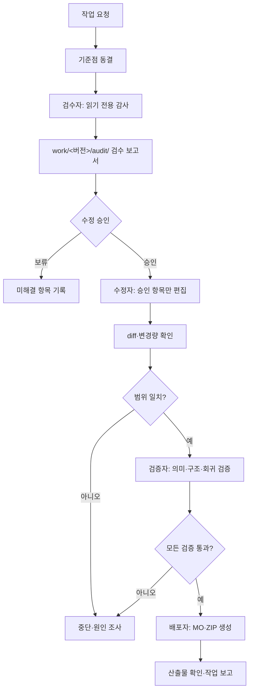

# Translation Work

이 디렉터리는 실제 번역을 수정하는 작업 공간입니다.

## 문서 기준

번역 판단 규칙은 버전별 `TRANSLATION-RULES.md` 한 곳에서 관리합니다.
이 README는 디렉터리 구조·검증 명령·MO 운영 등 실행 절차만 설명하며,
`glossary.tsv`는 승인된 개별 표준값과 예외를, `audit/`는 결정 근거와
변경 이력을 기록합니다. 문서가 충돌하면 실제 원문과 게임 문맥을 먼저
확인한 뒤 `PROJECT-AI.md`의 역할·flow, `TRANSLATION-RULES.md`의 번역
판단, `glossary.tsv`의 개별 표준값 순서로 재검토합니다.

## 구조

```text
work/
├── README.md
└── <버전>/
    ├── README.md
    ├── glossary.tsv
    └── ko/
        └── *.po
```

- `work/<버전>/ko/`: 실제로 수정하고 검토하는 한국어 PO 파일
- `work/<버전>/glossary.tsv`: 표준 번역, 일본어·중국어 참고 표현, 의미
  분류와 근거를 기록하는 작업용 용어집
- `po/<버전>/`: Wesnoth GitHub에서 받은 locale별 원본 PO 스냅샷
- `References/`: 과거 한국어 번역과 네이버 카페 등 참고 자료
- `References/wesnothko/translation-notes.tsv`: 한글화 팀 게시판과
  자유게시판에서 선별한 용어·명칭 참고 메모
- 버전 기본값은 루트 `VERSION`에서 읽으며, 도구 실행 시
  `WESNOTH_VERSION=<버전>`으로 덮어쓸 수 있습니다. 새 버전은 같은
  `po/<버전>/`, `work/<버전>/`, `dist/<버전>-<최종수정일>/` 구조를 사용합니다.
- `dist/<버전>-<최종수정일>/`의 MO와 메타데이터는 공개 산출물로 Git에
  포함합니다. 설치 도구는 대상의 기존 `*.mo`를 삭제하고 전체 MO 세트를
  동기화하며 다른 파일은 보존합니다. 문제가 생기면 `po/<버전>/ko/` 또는
  `work/<버전>/ko/`에서 MO를 다시 생성합니다.
- `tools/build_asset.sh <버전> <최종수정일> <ko_KR.cfg>`는 MO와
  `ko_KR.cfg`, 문서, 설치 스크립트를 포함한 배포 ZIP을 생성합니다.
- 번역 ZIP은 `data/`와 `translations/`를 ZIP 루트의 형제 디렉터리로
  유지합니다. `data/languages/ko_KR.cfg`는 언어 표시용이고,
  `translations/ko/LC_MESSAGES/*.mo`는 번역 바이너리입니다.
  `translations/`를 `data/` 아래로 옮기지 않습니다.
- 루트 문서의 버전 표기는 `docs/templates/*.md.in`에서 관리합니다.
  템플릿을 수정한 뒤 `python3 tools/render_docs.py`로 게시 문서를
  재생성하고, `--check`로 생성 결과를 검증합니다. 생성된 Markdown은
  직접 수정하지 않습니다.

## 역할과 업무 흐름

실제 작업은 다음 순서로 진행합니다. 같은 작업자나 AI가 여러 역할을 맡을
수 있지만, 검수와 수정을 한 번에 섞지 않습니다.



### 검수 단계

- PO, 용어집, 영어·일본어·중국어 원본과 참고 번역을 읽기만 합니다.
- 문제 후보마다 정확한 파일, `msgctxt`, `msgid`, 현재 번역, 수정 제안,
  근거, 확신도를 `work/<버전>/audit/`에 기록합니다.
- PO, 용어집, MO와 배포물을 수정하지 않습니다.
- 기존 번역이 맞거나 근거가 부족하면 `보류`로 기록합니다.

### 수정 단계

- `승인`된 검수 보고서 항목만 수정합니다.
- 보고서에 없는 항목과 이미 정상인 항목은 수정하지 않습니다.
- 쓰기 도구는 하나씩 실행하고 즉시 `git diff`를 확인합니다.
- 자동 정규화나 용어집 전체 재적용은 영향을 받는 항목이 보고서에
  모두 열거된 경우에만 허용합니다.
- 예상한 파일·항목·라인 수보다 많이 바뀌면 중단합니다.

### 검증 단계

- 실제 diff와 승인된 검수 보고서를 대조합니다.
- 기존 번역 훼손, 의미·문체·용어 불일치와 구조 표식 손실을 확인합니다.
- `python3 -m unittest discover -s tests -v`,
  `python3 tools/audit_po_completion.py`,
  `python3 tools/audit_po_structure.py`, 모든 PO의 `msgfmt --check`를
  실행합니다.
- 자동 감사가 통과해도 의미 검토를 생략하지 않습니다.

### 배포 단계

- 검증 통과 후에만 MO와 배포 ZIP을 생성합니다.
- 배포 단계에서는 PO나 용어집을 다시 수정하지 않습니다.
- 파일 목록, 버전, `PO_LAST_MODIFIED_DATE`, ZIP 내부의
  `data/`·`translations/` 구조를 확인한 뒤 작업 보고를 남깁니다.

### 단계 전환 조건

| 전 단계 | 다음 단계로 넘어가는 조건 | 실패 또는 보류 |
| --- | --- | --- |
| 기준점 동결 | 범위·버전·기준 커밋 기록 | 범위가 모호하면 질문 |
| 검수 | 후보와 근거가 보고서에 기록됨 | 근거 부족 항목은 보류 |
| 승인 | 수정 대상이 정확히 지정됨 | 승인되지 않은 항목은 수정 금지 |
| 수정 | diff가 승인 목록과 일치함 | 범위 초과 시 즉시 중단 |
| 검증 | 의미·구조·문법 검사가 모두 통과 | 실패 원인만 조사 |
| 배포 | 검증 결과와 산출물 목록 확인 | 검증 실패 시 배포 금지 |

검수 보고서는 광범위한 자동 재작성의 지시서가 아닙니다. 각 항목이 정확한
키나 용어를 가리킬 때만 해당 항목의 수정 범위를 승인하는 근거로 사용합니다.

### 파일 전환 게이트

PO 파일 하나를 완료 처리한 뒤 즉시 다음 파일로 이동하지 않습니다. 다음
순서를 모두 완료해야 파일 전환이 허용됩니다.

1. 해당 파일의 `보류`, `미해결`, `추가 검토` 항목을 다시 읽고, 현재
   용어집·관련 PO·영어 원문 문맥으로 재판정합니다.
2. 보류 항목을 `수정`, `문제 없음`, `계속 보류` 중 하나로 분류하고,
   근거와 영향 범위를 현재 파일 리포트에 기록합니다.
3. 용어집 변경이 있으면 실제 PO 전체 용례와 충돌 여부를 확인하고,
   승인된 영향 범위만 수정한 뒤 관련 회귀 검사를 실행합니다.
4. 이전 파일에서 발견된 공통 후보를 다음 파일의 검수 목록으로 이월하고,
   다음 파일을 열 때 먼저 이월 목록을 확인합니다.
5. 위 기록과 검증이 끝난 뒤에만 다음 PO 파일을 시작합니다.

따라서 파일 완료는 단순히 `msgfmt`가 통과한 상태가 아니라, 해당 파일의
보류 항목과 용어집 영향 범위를 재검토하고 이월 목록을 갱신한 상태를
뜻합니다.

## 작업 기준

- PO 파일의 구성과 `msgid`는 `po/<버전>/ko/`를 기준으로 유지합니다.
- 기존 한국어 표현은 `References/20250322_wesnoth_한국어번역/`을
  가능한 한 적극적으로 활용합니다. 다만 현재 영어 원문·게임 문맥·태그·
  placeholder와 충돌하면 그대로 복사하지 않고 근거를 남겨 조정합니다.
- 인명·지명·종족명·유닛명은 한글 표기를 우선합니다. 일본어가 영어를
  그대로 쓰더라도 한국어 영어 보존의 근거로 삼지 않습니다. 중국어는
  음역 비교용 보조 자료로 사용합니다.
- 음차는 철자 대 철자 치환이 아니라 영어의 실제 발음과 최신 한국어
  참고자료를 대조해 정합니다. 같은 `source_term`은 대소문자를 구분해
  하나의 한국어 표기로 통일합니다. `th`처럼 철자와 발음이 달라질 수
  있는 경우에는 단어 위치와 고유명사의 발음을 확인하며,
  `Arvith=아르비쓰`, `Mal Tath=말 타쓰`, `Verloth=베를로쓰`처럼
  확정된 표기는 용어집에 기록합니다. 일본어의 영어 보존과 중국어
  한자음은 발음 확인용 보조 자료일 뿐 한국어 표기의 직접 기준이
  아닙니다.
- 음차 검수 순서는 `References/20250322_wesnoth_한국어번역/` 및
  카페 자료 확인, 영어 발음 대조, 일본어·중국어 대조, 전체 PO 용례
  검색, 용어집 표준값 확정, 긴 문장 속 병기 재적용입니다. 이름의
  일부가 직함·호칭·일반명사인지 먼저 분리하고, `Mal Tath`,
  `Urza Fastik`처럼 여러 음차 요소로 이루어진 복합 인명도 `source_term`은
  전체 이름으로 유지하며, PO 표기는 용어집의 `standard_korean`을 그대로
  적용합니다.
- 첫 등장 여부를 사람이 판정해 병기하지 않습니다. `category` 분류를
  병기 기준으로 사용하지 않고, 용어집 각 행의 영어 원문과 한국어를
  직접 비교해 실제 음차된 부분만 `한글(English)`로 병기합니다.
  `Discord`, `Steam`, `IRC` 같은 외부 브랜드·프로토콜·식별자는 원문을
  유지합니다.
- 복합 고유명사는 직함·수식어와 이름을 구분합니다. `Minion of Tairach`는
  `타이라크(Tairach)의 졸개`, `Lady Dionli`는 `디온리(Dionli) 부인`처럼
  실제 이름 부분만 병기합니다. `Mal A’kai`, `Mal Tath`,
  `Urza Fastik`처럼 여러 단어로 이루어진 고유 인명도
  `말 아카이(Mal A’kai)`, `말 타쓰(Mal Tath)`,
  `우르자(Urza) 파스티크(Fastik)`처럼 용어집에 확정된 표기를 사용합니다.
- 영어(`en_GB`)를 기본 원문으로 확인하고, 일본어(`ja`)와
  중국어(`zh_CN`)는 보조 참고 자료로 사용합니다.
- 번역을 수정한 뒤에는 `tests/`의 구조·문법 검사를 실행합니다.
- `glossary.tsv`는 검수된 참고 기준이지만 불변의 진실은 아닙니다. 실제
  PO 문맥과 충돌하면 용어집의 오류·과잉 일반화·문맥 누락 가능성을 먼저
  검수하고, 자동으로 PO 전체에 재적용하지 않습니다.
- 용어집 1차 검수가 끝난 뒤에는 `ko/*.po` 전체를 다시 읽는 2차 전수
  번역 검수를 수행합니다. 자동 감사가 통과해도 의미, 문체, 조사,
  고유명사 병기, 문맥별 일관성 검토를 생략하지 않습니다.
- `sync_contextual_glossary.py`, `sync_glossary_korean.py`,
  `normalize_contextual_translations.py`처럼
  PO나 용어집을 수정하는 도구는 먼저 단독으로 실행하고 종료를 확인합니다.
  이 도구들과 테스트·`msgfmt`·감사 명령을 병렬 실행하지 않습니다.
- `source_term`에 `^`가 포함된 항목은 먼저 일반 문맥 키인지 Wesnoth의
  성별 표기인지 확인합니다. `feature^Open`, `filesystem^Open`처럼 일반
  문맥 키인 경우 `^` 앞부분은 식별자로 보존하고 뒤의 표시 문자열만
  번역합니다. `source_term`에는 전체 키를 기록합니다.
- `female^`, `male^`, `race^`도 gettext 문맥 식별자입니다. 원문 전체 키는
  `source_term`에 보존하지만, `msgstr`와 표준 한국어에는 `^` 뒤의 표시
  문자열만 기록합니다. `여성`, `암컷`, `종족`이 실제 번역 의미인 경우에는
  일반 한국어 단어로 남길 수 있지만 `여성^회복됨`처럼 접두사를 표시하지
  않습니다.
- 성별 문맥 키는 한국어에 기계적으로 `여성`·`남성`을 덧붙이는 근거가
  아닙니다. `female^Mage`처럼 직업·특성·능력명이 한국어에서 성별 중립이면
  기본형과 같은 번역을 사용합니다. 반대로 `Princess`, `Queen`, `Lady`,
  `Priestess`, `Sorceress`, `Baroness`, `Watchwoman`, 친족 호칭처럼 영어
  표시 문자열 자체가 성별 의미를 가지면 자연스러운 한국어 대응어가 있는지
  별도 검토합니다. `공주`, `여왕`, `부인`, `여신관`, `마녀`, `남작 부인`은
  성별 의미를 보존하되, `Watchwoman`처럼 인위적인 `여성 야경꾼`보다
  중립형 `야경꾼`이 자연스러운 경우에는 중립형을 사용합니다. 동물
  개체명처럼 성별이 식별 자체인 경우만 용어집에 명시적 예외로 기록합니다.
- 성별형 검수는 `category`로 판단하지 않습니다. `female^Elvish Archer`
  는 `female^`가 문맥 식별자이고 `Archer`가 성별 중립 직업명이므로
  `요정 궁수`로 유지합니다. 반면 `Sorceress`, `Princess`, `Queen`,
  `Baroness`, `Priestess`처럼 영어 표시 문자열 자체가 여성형이면
  대응하는 한국어 성별 의미를 보존합니다.
- `tools/audit_gender_terms.py`는 영어 성별 어휘쌍과 `female^`/`male^`
  기본형 불일치, `Mage`·`Sorcerer`·`Wizard`의 번역 충돌을 감사합니다.
  자동 변경 도구가 아니며, 출력된 후보는 원문·일본어·중국어·기존
  한국어 참고자료를 대조해 용어집에 반영합니다.
- 활성 메시지뿐 아니라 `#~`로 표시된 obsolete 메시지도 고유명사 병기,
  태그, placeholder 검수 대상에 포함합니다. obsolete 메시지는 삭제하지
  않고 과거 자료로 보존하되, 현재 표기 규칙에 맞지 않으면 함께 정리합니다.
- `^`가 있는 항목은 전체 키를 하나의 독립된 항목으로 취급합니다. 문맥
  접두사가 다르면 표시 문자열이 같아도 용어집 항목과 번역을 합치지 않습니다.
- 같은 `msgid`라도 PO 주석 문맥에 따라 뜻이 달라질 수 있습니다. 예를 들어
  `Music`은 `[about]`에서는 `음악 담당`, `[column]`에서는 `음악`입니다.
  이런 항목은 용어집 하나의 표준값으로 합치지 않고 PO 문맥별 번역을
  유지합니다.
- `Saurian`은 웨스노스의 고유 종족명이므로 `사우리안`, `Saurians`는
  `사우리안들`로 번역합니다. 일반 동물명인 `Lizard/lizard`와 혼동해
  `도마뱀`으로 바꾸지 않습니다.
- `Wyrm`은 일괄 치환하지 않습니다. 중립적인 생물명·유닛명은
  `웜(Wyrm)`, `웜`, 또는 문맥상 `뱀룡`을 사용합니다. 다만 화자가
  `wyrm`을 다른 생물을 낮춰 부르는 멸칭으로 사용하는 대사는 화자와
  장면을 확인해 `도마뱀/도마뱀들`로 번역할 수 있습니다. 이 예외는
  원문 주석이나 대화 문맥을 근거로 용어집 `notes`와 검수 리포트에
  기록하며, 자동 일괄 치환하지 않습니다.
- 종료·이탈 관련 UI 동사는 영어 단어만 보고 기계적으로 통일하지
  않습니다. 실제로 끝나는 대상과 화면 동작을 기준으로 구분합니다.

  | 원문 | 기본 번역 | 사용 기준 |
  | --- | --- | --- |
  | `Close` | `닫기` | 창·대화 상자·지도·패널을 닫음 |
  | `Exit` | `나가기` 또는 `종료` | 현재 화면·모드에서 나가거나 응용 프로그램을 종료함 |
  | `Quit` | `종료` | 게임·프로그램 세션을 끝냄 |
  | `Leave` | `떠나다` 또는 `나가기` | 장소·로비·게임에서 떠남 |
  | `Terminate` | `중지` 또는 `종료` | 실행 중인 스크립트·프로세스를 끝냄 |

  `Exit`는 기본적으로 화면·모드 이탈이면 `나가기`, 프로그램 자체의
  종료 버튼이면 `종료`를 사용합니다. `Quit to Menu`와
  `Quit to Desktop`처럼 목적지가 표시된 항목은 각각 `메뉴로 나가기`,
  `바탕 화면으로 나가기`처럼 자연스러운 UI 표현을 우선합니다.
  `Close`는 프로그램을 끝내지 않고 대상 창이나 패널만 닫는 경우에만
  사용합니다. 서사 문장의 `leave`는 UI 규칙을 적용하지 않고 문맥에 따라
  `떠나다`, `두고 가다`, `남겨 두다` 등으로 번역합니다.
- 일반 응답인 `yes`·`no`는 `예`·`아니오`로 번역합니다. `있음`·`없음`은
  존재 여부나 상태값이라는 문맥이 확인된 경우에만 사용합니다.
- 용어집에는 반복되는 용어, 고유명사, 게임 규칙 용어, 짧은 고정 UI
  표현만 기록합니다. 일반적인 긴 대사와 설명문은 해당 PO의 `msgstr`로
  번역하며 용어집에 복사하지 않습니다.
- manpage의 긴 옵션 설명도 용어집에 복사하지 않습니다. `B<>`, `I<>` 표식,
  옵션명, 명령 구문, 파일명, URL, 경로와 역슬래시는 보존하고 설명만
  해당 PO에서 번역합니다.
- 도구 이름은 원문을 보존합니다. 예를 들어 `wmllint`는 `wmllint`로
  유지하고, `wmllint mode`는 `wmllint 모드`로 번역합니다. 도구 이름에
  `교정`처럼 원문에 없는 의미를 덧붙이지 않습니다.
- `Tarek`처럼 일본어는 `Tarek`, 중국어는 음역, 한국어는 `타렉`인 경우가
  있을 수 있습니다. 이런 항목은 일본어의 영어 보존을 따라가지 않고,
  최신 한국어 참고자료의 한글 표기를 표준으로 삼습니다. `Discord`,
  `Steam`, `IRC` 같은 외부 브랜드·프로토콜·식별자는 별도 예외입니다.
- 과거 대안과 논쟁은 `forbidden_terms`, `translation-notes.tsv` 및
  참고자료에 기록하며 표준 번역으로 사용하지 않습니다.
- 용어집의 `forbidden_terms`는 과거 표현 또는 현재 검토 중인 대안이며,
  금지어로 최종 확정하기 전에는 문맥을 반드시 확인합니다.
- 용어집 열은 다음 의미로 사용합니다.
  - `source_term`: 원문 용어 또는 짧은 고정 표현입니다. 긴 대사와 설명문은
    기록하지 않습니다.
  - `standard_korean`: 최종 표준 한국어 표현입니다.
  - `reference_japanese`, `reference_chinese`: 해당 PO에 실제로 있는
    일본어·중국어 표현이며 새로 번역해 넣지 않습니다.
- `category`: 인명·지명·유닛명·일반 용어 등을 구분하는 의미 분류입니다.
    `category`(분류)이며, `person_name`, `place_name`, `race_name`,
    `proper_noun`, `unit_name`, `faction`, `ability`, `contextual`,
    `terrain`, `attack_type`, `ui`, `command`, `term` 등을 사용합니다.
    인명·지명·고유명사·UI·명령어를 모두 `term`으로 뭉뚱그리지 않습니다.
- `Great River`와 `The Great River`는 고유 지명 `위대한 강`으로 통일합니다.
  원문에 해당 표현이 있는 문장에서도 `대하`·`한강`을 사용하지 않으며,
  일반적인 `river`에는 적용하지 않습니다.
  - `forbidden_terms`: 실제로 채택하지 않을 과거 표현·오역·대안입니다.
    해당 항목이 없으면 빈 칸으로 둡니다.
  - `notes`: 병기·예외·번역 선택처럼 출처 경로만으로 설명되지 않는
    판단 근거만 기록합니다. 실제 PO 출처는 `po/<버전>/`의 locale별
    디렉터리와 프로젝트 문서로 확인하며, 자동으로 반복되는 출처·분류
    설명은 기록하지 않습니다.
- 영어 원문이 한국어에 남아 있다는 사실만으로 병기하지 않습니다. 외부
  서비스명·폰트명·프로토콜·약어·도구명·모드 식별자는 필요하면 영문 그대로
  유지하고, 내부 인명·지명·실제 이름 구성요소만 음차와 함께
  `한글(English)`로 표기합니다. 이 판정은 `category`가 아니라 원문과
  한국어 표기의 토큰을 직접 대조해 수행합니다.
- 병기 정규화 도구는 멱등적이어야 합니다. 반복 실행해도 수동으로 확정한
  표준 번역이 자동 추론에 의해 되살아나거나 다른 값으로 변하지 않아야 합니다.
- 숫자만 있는 항목, 기호만 있는 항목, 긴 문장·대사·설명문은 용어집에
  넣지 않습니다. 실제 게임 식별자나 기호 리터럴만 `identifier` 문맥으로
  예외를 둘 수 있습니다.
- 현재 수동 번역 배치는 기본 50개로 진행합니다. 처리 속도를 이유 없이
  10개, 20개 또는 40개로 줄이지 않습니다. 태그·placeholder·실제 `\n`·복수형,
  `^` 문맥 키, 고유명사 충돌, 긴 대사 또는 참고 자료 간 충돌처럼 검토
  비용이 높은 항목만 별도 소배치로 나눌 수 있습니다. 소배치가 끝나면
  다음 배치부터 다시 50개로 진행하고, 분할 사유와 항목 수를 작업 보고에
  남깁니다.
- 번역문은 원문의 구조적 표식을 보존해야 합니다. 실제 `\n`과 문단·대사
  경계를 유지하고, PO의 문자열 분할 줄과 게임 개행을 혼동하지 않습니다.
  `<i>`, `<b>`, `<span ...>`, `<ref ...>` 같은 Pango/HTML 태그의 이름,
  속성, 짝, 개수를 유지하며, `%s`, `%d`, `$unit.name`, `$gold_cost`
  같은 placeholder도 철자와 대소문자를 그대로 유지합니다. 한국어 조사는
  placeholder 뒤에 붙이되 이름 안에 포함하지 않습니다.
- 모든 일반 `^` 문맥 키의 앞부분은 UI 표시 문자열이 아닌 식별자이므로
  번역문에 넣지 않습니다. `female^`, `male^`, `race^`도 예외가 아닙니다.
  용어집에는 검색·대조를 위해 전체 `source_term`을 기록합니다.
- 복수형 항목은 `msgid_plural`과 `msgstr[n]` 구조를 유지합니다. 빈
  `msgstr[n]`은 미번역으로 보고, fuzzy 표시가 있는 항목도 검토 전에는
  완료로 세지 않습니다.

## 전체 PO 전수 검수

용어집을 참고 기준으로 삼되 오류 가능성을 열어 둔 채
`work/<버전>/ko/*.po`의 모든 활성 메시지를
다시 검토합니다. 이 단계는 미번역 개수 확인과 별개이며, 이미 번역된
문장도 다음 기준으로 재검수합니다.

- 승인된 용어집 값이 실제 PO 문맥에 맞게 적용되었는가
- 용어집 값이 실제 PO의 의미·문체와 충돌하거나 과도하게 일반화되지
  않았는가
- 영어 음차가 철자 치환이 아니라 발음과 최신 한국어 표기에 근거하는가?
  `th` 등 발음 예외, 복합 인명, 긴 설명문 속 병기가 전체 PO에서
  동일한가?
- 영어 의미와 게임 문맥이 보존되었는가
- 일본어·중국어 및 `References/20250322_wesnoth_한국어번역/`과 비교해
  누락·과역·문체 불일치가 없는가
- 조사, 존대, 명령형, 수식어 위치가 자연스러운가
- `^`, 실제 `\n`, 태그, placeholder, 복수형, roff 표식이 보존되었는가
- 같은 화자가 말하는 대사는 장면과 상대에 따른 의도적인 변화가 아닌 한
  같은 존대 수준과 말투를 유지하는가. `tools/audit_speaker_style.py`는
  후보를 찾는 보조 도구일 뿐이며, 화자별 문장 의미와 장면을 읽는
  수동 검수 대상입니다.
- `random_names.lua`처럼 게임이 런타임에 사용하는 쉼표 구분 이름 목록은
  일반 문장이나 표시되는 고유명사 목록이 아니므로 고유명사 병기 감사에서
  제외합니다. 이 예외는 해당 파일 경로와 충분한 쉼표 수를 함께 확인하며,
  일반적인 장문 서사·대사에는 적용하지 않습니다.
- `data/core/macros/names.cfg`의 이름 생성기 문법도 같은 원칙으로
  처리합니다. 런타임 조합 결과인 `Losel`처럼 원문 데이터에 독립적으로
  존재하지 않는 이름은 PO 누락으로 보지 않으며, 생성 규칙의 토큰을
  임의로 번역·음차하지 않습니다. 생성기 구조를 보존해야 랜덤 이름
  생성이 깨지지 않습니다.

전수 검수 중 용어집과 PO가 충돌하면 정확한 키·현재 번역·용어집 값·
문맥 근거·영향 범위를 `audit/`에 기록합니다. 용어집 변경은 승인 후에만
수행하고, 관련 PO 전체에 자동 재적용하지 않으며 승인된 영향 범위만 수정한
뒤 변경 항목을 다시 검토하고 테스트와 구조 감사를 실행합니다.

## 규칙·예외 유지보수

번역 작업 중 발견한 판단 기준은 다음 범위에 맞춰 기록합니다.

- 모든 AI·사람 작업자에게 적용되는 규칙: `PROJECT-AI.md`
- 버전별 작업 흐름, 우선순위, 반복되는 예외: 이 문서
- 반복 용어의 표준 한국어, 일본어·중국어 참고값, 금지 표현과 근거:
  `work/<버전>/glossary.tsv`
- 자동으로 재현할 수 있는 구조·형식 문제: `tests/`
- 특정 번역문에만 필요한 설명: 해당 PO의 기존 주석 또는 검토 기록

예외를 추가할 때는 `왜 기본 규칙을 적용할 수 없는지`, `어떤 파일과
문자열에 영향을 주는지`, `다음 작업자가 어떻게 재현·검증할 수 있는지`를
함께 적습니다. 원문 오류처럼 보이는 태그·placeholder·개행·공백은
번역 예외로 처리하지 않고 먼저 검토 상태로 둡니다. `^` 문맥 키, 복수형,
manpage 표식, 명령어·경로 리터럴은 일반 문장과 다른 구조를 갖지만,
그 구조를 보존하는 것이 규칙이지 임의 변경을 허용하는 예외가 아닙니다.

용어집을 수정한 경우에는 실제 PO 전체 용례와 충돌 여부를 먼저 확인하고,
승인된 영향 범위의 PO에만 반영되었는지 확인하며,
문서 규칙이 바뀐 경우에는 해당 규칙을 검증하는 테스트를 함께 추가하거나
기존 테스트를 갱신합니다. 배치가 끝날 때는 변경 범위, 참고한 자료,
검증 명령과 남은 검토 대상을 작업 보고에 남깁니다.

## 용어집과 PO 동기화

gettext 문맥 항목을 재검토하거나 용어집을 갱신한 뒤에는 다음 도구를
실행해 용어집과 작업용 한국어 PO를 함께 맞춥니다.

```sh
python3 tools/sync_contextual_glossary.py
python3 tools/audit_and_pair_embedded_names.py
python3 tools/apply_name_translation_overrides.py
python3 tools/normalize_glossary_labels.py
python3 tools/sync_glossary_korean.py
python3 tools/audit_po_structure.py
```

## 검증

프로젝트 루트에서 실행합니다.

```sh
VERSION="${WESNOTH_VERSION:-$(tr -d '\r\n' < VERSION)}"
python3 -m unittest discover -s tests -v
python3 tools/audit_glossary.py
python3 tools/audit_and_pair_embedded_names.py --check
python3 tools/audit_po_completion.py
python3 tools/audit_po_structure.py
find "work/$VERSION/ko" -name '*.po' -print0 |
  xargs -0 -n1 msgfmt --check --output-file=/dev/null
```

`audit_po_structure.py`는 현재 작업 PO에 남은 태그·placeholder 불일치를
보고하는 감사 도구입니다. 결과가 0이 아니면 번역을 완료로 표시하지 않고
파일과 `msgid`를 검토 목록으로 남깁니다. 원문 자체가 불균형한 태그를
가지거나 도구의 인식 범위를 벗어난 특수 표식인 경우에도 임의로 삭제하지
말고, 원문·번역문·참고 locale을 대조한 뒤 규칙 또는 테스트를 갱신합니다.
`msgfmt --check`의 기본 헤더 경고는 PO 문법 오류와 구분하여 보고하되,
새 작업 파일의 헤더를 확인합니다.

## 문서만으로 하는 감사

새 작업자는 대화 기록 없이 `PROJECT-AI.md`, 루트 `README.md`,
`INSTALL.md`, 이 문서, 버전별 README와 `glossary.tsv`만 읽고도 결과를
검증할 수 있어야 합니다.

감사 대상은 `work/<버전>/ko/*.po`의 활성 메시지입니다. 첫 번째
`msgid ""` 헤더와 `#~` obsolete 항목은 진행률에서 제외합니다. 활성
`#, fuzzy`는 번역문이 있어도 미확정으로 세며, 비-fuzzy `msgstr ""`와
복수형의 빈 `msgstr[n]`은 미번역으로 셉니다. `msgfmt --check`의 헤더
기본값 경고는 종료 코드와 분리해 기록합니다.

감사할 때는 활성 PO의 빈 번역·빈 복수형·`fuzzy`, 용어집-PO 불일치,
금지 대안 재등장, 고유명사 병기 누락, `^` 문맥 접두사 누출,
태그·placeholder·실제 `\n` 불일치를 확인합니다. `#~` obsolete 항목은
활성 진행률에서는 제외하지만, 고유명사 병기·태그·placeholder 감사에는
포함합니다.

```sh
VERSION="${WESNOTH_VERSION:-$(tr -d '\r\n' < VERSION)}"
python3 -m unittest discover -s tests -v
python3 tools/audit_glossary.py
python3 tools/audit_po_structure.py
python3 tools/audit_and_pair_embedded_names.py --candidates \
  | tee "work/$VERSION/audit/embedded-name-candidates-$(date +%Y%m%d).txt"
python3 tools/audit_and_pair_embedded_names.py --check
find "work/$VERSION/ko" -name '*.po' -print0 |
  xargs -0 -n1 msgfmt --check --output-file=/dev/null
```

활성 빈 번역과 fuzzy를 파일별로 확인하려면 다음을 추가로 실행합니다.

```sh
for po in "work/$VERSION/ko"/*.po; do
    untranslated="$(
        msgattrib --untranslated --no-fuzzy --no-obsolete "$po" |
        awk '$1 == "msgid" { count++ } END { print count + 0 }'
    )"
    fuzzy="$(
        msgattrib --only-fuzzy --no-obsolete "$po" |
        awk '$1 == "msgid" { count++ } END { print count + 0 }'
    )"
    printf '%s untranslated=%s fuzzy=%s\n' "$po" "$untranslated" "$fuzzy"
done
```

정상 결과는 활성 fuzzy 0, 빈 번역 0, 빈 복수형 0,
`markup_mismatches=0`, `placeholder_mismatches=0`, 용어집-PO 불일치
0건입니다.

활성 PO의 명백한 맞춤법·띄어쓰기 오류는 문맥을 확인한 뒤
`tools/normalize_korean_spacing.py`로 보수적으로 정규화합니다.
`첫 번째`, `세 번째`, `대가`, `할 수`, `될 것`처럼 의미가 변하지 않는
규칙만 자동화하며, obsolete(`#~`) 항목은 역사적 자료로 보존합니다.
자동 정규화 뒤에는 원문·참고 locale 대조와 전체 테스트를 다시 실행합니다.

## MO 빌드와 설치 도구

- `tools/build_mo.sh [version] [output_dir]`: macOS·Linux에서
  `work/<version>/ko/*.po`를 `msgfmt --check`로 검사하고 MO를 생성합니다.
  마지막 PO 수정 시각을 KST/JST 기준
  `YYYY-MM-DD HH:MM:SS+0900` 형식으로
  `dist/<version>-<last-modified-date>/ko/PO_LAST_MODIFIED_DATE`에 기록합니다.
- `tools/build_mo.bat [version] [output_dir]`: Windows에서 같은 작업을
  수행하고 전체 작업 PO 중 가장 최근의 최종 수정 시각을 같은
  메타데이터 파일에 기록합니다. MO 생성 시각은 기록하지 않습니다.
- `tools/install_mo.sh <target_dir> [source_dir]`: macOS·Linux에서
  명시한 `translations/ko/LC_MESSAGES`에 MO를 설치합니다.
- `tools/install_mo.bat <target_dir> [source_dir]`: Windows에서 같은
  작업을 수행합니다.
- `tools/mark_korean_locale.sh <ko_KR.cfg>` 및
  `tools/mark_korean_locale.bat <ko_KR.cfg>`: 게임 언어 목록에
  `한국어 (<작업버전>-<최종수정일>)` 표식을 기록합니다. Windows ZIP판은
  `data\languages\ko_KR.cfg`를 직접 지정합니다.

설치 도구는 대상 경로를 자동 추측하지 않습니다. 기존 `*.mo`가 있으면
삭제 후 새 MO 전체를 복사하므로, 잘못된 Wesnoth 설치본에 복사하지 않도록
게임의 데이터 경로를 먼저 확인합니다. 문제가 생기면
`po/<버전>/ko/` 또는 `work/<버전>/ko/`에서 MO를 다시 생성합니다.
게임에 적용하기 전에는
`INSTALL.md`의 운영체제별 경로 확인 절차를 먼저 수행합니다.

## 용어집 판정 규칙

`work/<버전>/glossary.tsv`는 불변 데이터가 아니라 검수 결과를 기록한
참고 기준으로 보고, 다음 순서로 검수합니다.

1. `source_term`은 PO의 실제 `msgid`를 대소문자까지 그대로 기록합니다.
   `^`가 있으면 전체 키를 기록하고 다른 문맥의 같은 표시 문자열과
   합치지 않습니다.
2. 반복 용어, 고유명사, 게임 규칙 용어, 짧은 고정 UI만 기록합니다.
   긴 문장·대사·설명문·숫자만 있는 값은 기록하지 않습니다.
3. `standard_korean`은 실제 표시 문자열에 대한 현재 승인값입니다. 같은
   `source_term`이라도 PO 문맥이 다르면 하나의 값으로 강제하지 않습니다.
   실제 PO와 충돌하면 용어집 오류 후보로 기록하고 전체 용례를 조사합니다.
4. 같은 어근에서 파생된 용어는 기본형·복수형·성별형·수식형의 관계를
   유지합니다. 예를 들어 `Sorcerer`를 `마법사`로 정했다면
   `Dark Sorcerer`는 `흑마법사`로 연결합니다. `Sorceress`처럼 영어의
   여성형 파생어는 한국어에서 `마녀`처럼 성별과 어감을 드러내는 표현을
   사용할 수 있습니다. `Mage`, `Wizard`,
   `Necromancer`처럼 영어 원어가 다른 용어는 문맥과 게임 분류를 대조한
   뒤 독립적으로 결정합니다.
5. `category`는 인명·지명·종족명·유닛명·일반 용어 등을 설명하는 분류일
   뿐이며, 번역 여부나 병기 여부를 결정하는 기준이 아닙니다.
6. 영문 잔존만으로 병기하지 않습니다. 외부 브랜드·서비스명·폰트명·
   프로토콜·약어·도구명·모드 식별자는 영문 그대로 둘 수 있습니다.
7. 내부 인명·지명·실제 이름 구성요소를 음차한 경우에만 그 부분을
   `한글(English)`로 병기합니다. 복합어 전체를 괄호에 넣지 않으며
   조사·호칭·수식어는 괄호 밖에 둡니다.
   이름이 여러 단어로 이루어졌더라도 `source_term`은 전체 이름으로
   유지하며, 복합 인명을 자동으로 요소 분해하지 않습니다. 예를 들어
   `Mal A’kai`는 `말 아카이(Mal A’kai)`로 씁니다.
   `Contender Gorlack`의 `Contender`처럼 직함·역할·수식어는 병기하지
   않습니다. `Naga Myrmidon`처럼 앞부분이 번역된 종족명이고 뒷부분만
   음차한 유닛명인 경우에는 `나가 미르미돈(Myrmidon)`처럼 음차한 부분만
   병기합니다.
   - `Garard II` → `가라르드(Garard) 2세`
   - `Garard’s Hold` → `가라르드(Garard)의 요새`
   - `Fire Dragon` → `불의 드래곤(Dragon)`
   - `Masked Dwarf` → `가면 쓴 난쟁이`
   약어·일반 명칭·편집기 좌표 레이블은 음차가 아니므로 원문을
   괄호로 반복하지 않습니다. `AToTB` → `형제`, `Northerners` →
   `북부인`, `Base.x` → `기준점 X`처럼 기록합니다.
7. `forbidden_terms`는 폐기 표현·오역·검토에서 제외한 대안이 있을 때만
   기록하고, 없으면 빈 칸으로 둡니다. `notes`도 병기·예외·번역 선택처럼
   재검수에 필요한 결정만 기록합니다.
8. 일본어·중국어 열은 실제 PO의 참고값이며 한국어 자동 번역 규칙이
   아닙니다. 최우선 한국어 참고자료와 현재 영어 문맥을 함께 확인합니다.

## 영어·일본어·중국어 전수 대조

전체 활성 PO 항목은 다음 명령으로 동일한 gettext 키를 맞춰 비교합니다.
출력은 영어와 동일한 한국어, 영어 잔존, 누락된 placeholder 후보를
찾기 위한 검토 목록입니다. 후보를 자동으로 덮어쓰지 않습니다.

```sh
python3 tools/audit_locale_comparison.py --limit 200
```

이 도구의 영어 잔존 후보는 자동 실패 목록이 아니다. 폰트명(`Lato`),
압축 방식(`Bzip2`, `Gzip`), 명령어·식별자·변수·생성용 문법은 원문을
유지할 수 있다. 반면 지도 제목·UI 문구·설명문에 영어가 남아 있으면
일본어·중국어와 대조해 실제 누락인지 확인하고 한국어로 수정한다.
후보를 예외 처리할 때도 placeholder, 태그, `^` 문맥 키의 구조는
변경하지 않는다.

고유명사 후보 감사 결과는 `work/<버전>/audit/`에 날짜별로 저장한다.
각 후보를 영어·일본어·중국어·기존 참고 번역과 대조한 뒤 용어집에
등록하거나 정당한 영어 잔존 예외로 판정한다.

문장형 용어집 후보도 `work/<버전>/audit/`에 별도로 기록하고,
PO 문맥을 확인한 뒤 용어집에서 제거하거나 짧은 UI 고정 문구로 남긴다.

2026-09-25 전수 대조에서 활성 키 20,564개를 영어·일본어·중국어와
맞췄고, 구조·placeholder 감사는 통과했다. 남은 후보는 기술 문자열,
생성 문자열, 고유명사와 일부 영어 잔존을 포함하므로 후보별 의미 검토를
계속한다.
9. 용어집 수정 후 PO를 동기화하고, 정규화 도구를 두 번 실행해도 파일이
   변하지 않는지 확인합니다. 테스트·구조 감사·`msgfmt --check`까지
   통과해야 해당 검수를 완료로 기록합니다.

검수 체크리스트:

- [ ] 실제 PO `msgid`와 대소문자까지 일치하는가?
- [ ] 중복·문장·대사·숫자 전용 항목이 없는가?
- [ ] 표준 번역이 모든 관련 PO와 일치하는가?
- [ ] 기술 식별자와 음차 누락을 구분했는가?
- [ ] 병기된 괄호 안에는 실제 음차 원문만 있는가?
- [ ] 조사·호칭·수식어가 괄호 밖에 있는가?
- [ ] `^` 문맥 키와 `msgctxt`를 다른 항목과 합치지 않았는가?
- [ ] `forbidden_terms`와 `notes`가 필요한 경우에만 있는가?
- [ ] PO 동기화와 반복 실행 검사를 마쳤는가?
